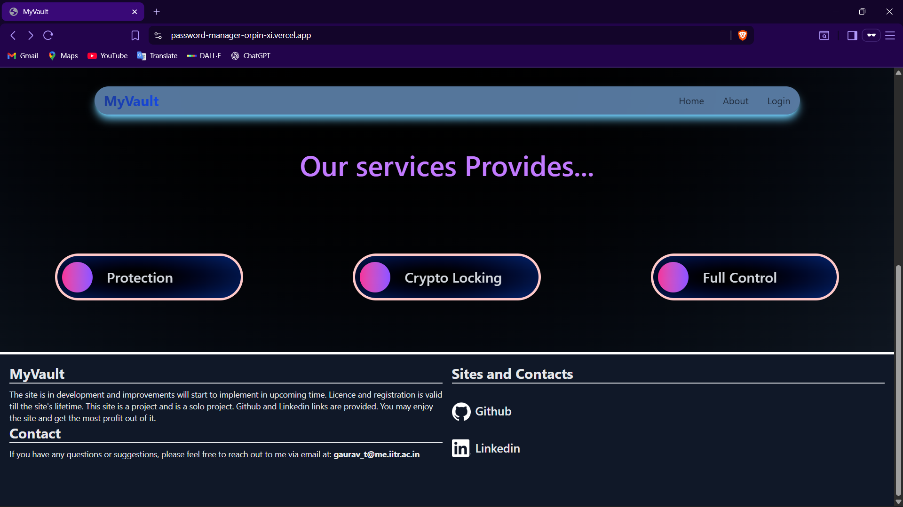

# 🔐 Secure Password Manager with Browser Extension

A full-stack **MERN Password Manager** that securely stores credentials and supports **automatic login & form autofill** using a custom browser extension.

The project is built with security and usability in mind, featuring encrypted storage, protected APIs, and a modern responsive UI.

🌐 Live Demo: (Vercel Frontend)  
🖥 Backend: (Render API)  
🧩 Browser Extension: Included in this repo

---

## ✨ Features

- 🔑 Securely store and manage passwords
- ⚡ Automatic website login & form autofill using a custom Web Extension
- 🔒 Password hashing using crypto
- 🛡️ API protection using Helmet.js (XSS, clickjacking, MIME-sniffing, etc.)
- 🎨 Fully responsive UI built with Tailwind CSS
- 🧠 State management using Zustand
- 🌍 Deployed frontend on **Vercel** and backend on **Render**

---
## 🖼 Screenshots

### 🏠 Home Page

  
   
  

### 📋 Main Page

  

---

## 🛠 Tech Stack

- **Frontend:** React, Tailwind CSS, Zustand  
- **Backend:** Node.js, Express, MongoDB  
- **Security:** crypto, Helmet.js  
- **Extension:** JavaScript, HTML, CSS (Web Extension APIs)  
- **Deployment:** Vercel (Frontend), Render (Backend)

---

## ⚙️ Running Locally

You need to run **both client and server**.

### 1️⃣ Clone the repository

git clone <your-repo-url>

cd <your-repo-name>
### 2️⃣ Install dependencies
cd Frontend && npm install

cd ../Backend && npm install
### 3️⃣ Start both using start-all.bat
@echo off

start cmd /k "cd Frontend && npm run dev"

start cmd /k "cd Backend && npm run dev"
